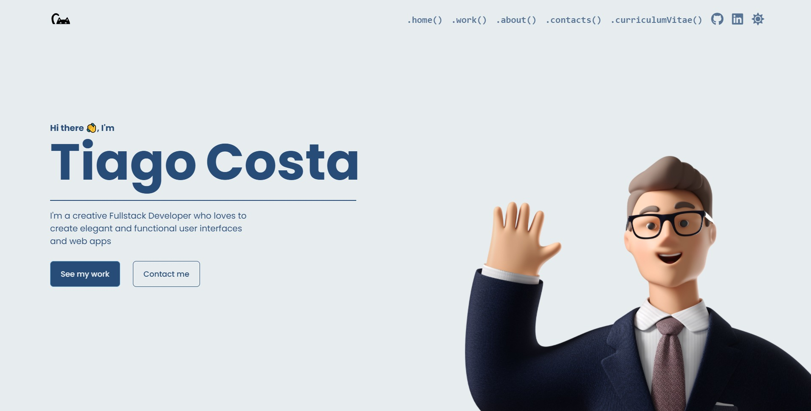

# Portefolio Website

This is my personal portefolio website, it was one of the funnest projects I've developed so far as I was able to unleash my creative potential on it and learn a bit more on CSS and Javascript animations.
Code really is the modern's day version of magic.

## Overview

### Screenshot

### Links

- Live Site URL: [Hosted on Vercel](https://tiagocostadev.com)

### Built with

- Semantic HTML5 markup
- CSS custom properties
- Flexbox
- Typescript
- [Vue3](https://v3.vuejs.org/) - JS library
- [SASS](https://sass-lang.com/) - CSS extension

## Acknowledgments

A special thanks to Leo and Mirti for having the patience of hearing me rambling about all the silly bugs I find during the development of my projects, to Carolina for the amazing cat logos 💞, to Blue for the hype on all the cool things I build and to Sp1ke for all the creative brainstorm we do together.
